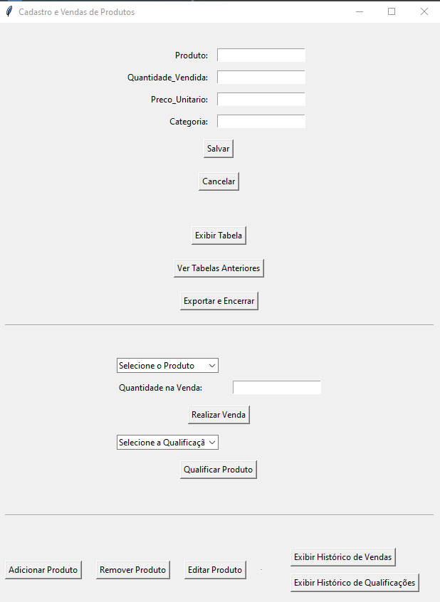

##  Cadastro e Vendas de Produtos

# Descrição do Projeto




Este projeto é uma aplicação de desktop para cadastro, vendas e qualificações de produtos, desenvolvida em Python. A interface gráfica é construída utilizando a biblioteca Tkinter, e a manipulação de dados é realizada com as bibliotecas pandas e seaborn para análise e visualização.

# Funcionalidades Principais

1. **Cadastro de Produtos:**
   - Nome do Produto
   - Quantidade Vendida
   - Preço Unitário
   - Categoria

2. **Vendas:**
   - Realização de vendas simuladas, atualizando a quantidade vendida no cadastro do produto.

3. **Qualificações:**
   - Possibilidade de qualificar produtos com as opções: "Ótimo", "Bom", "Regular" e "Ruim".

4. **Histórico:**
   - Visualização de histórico de vendas e qualificações realizadas.

5. **Exportação de Dados:**
   - Exportação dos dados cadastrados para um arquivo CSV.

# Requisitos do Sistema

- Python 3.x
- Pandas
- Matplotlib
- Seaborn
- PandasTable
- Tkinter
- Openpyxl (para exportação para Excel)

# Como Executar o Projeto

1. Clone este repositório:
   ```bash
   git clone https://github.com/kauecalixto/Projetos-Desafios/new/Projetos_ocalixto.git


